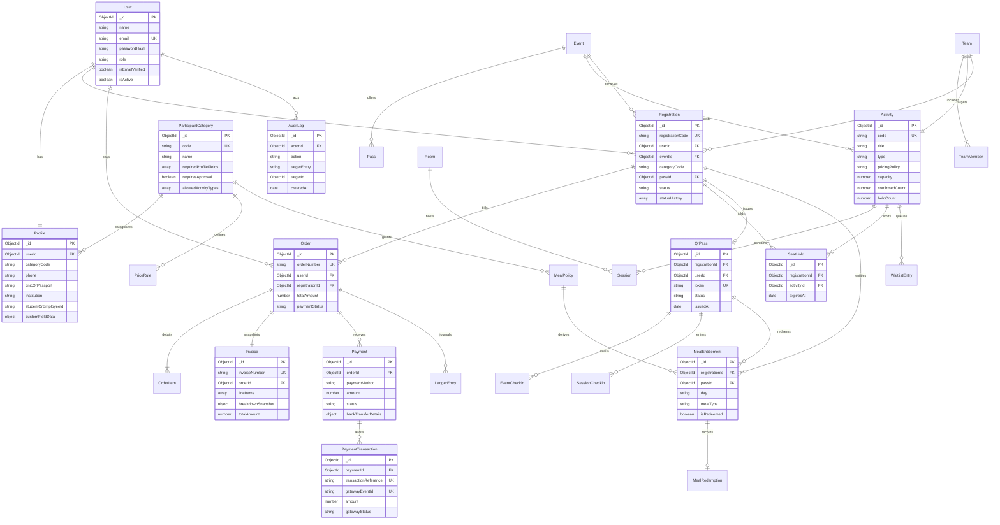

# ICOSST 2026 Entity-Relationship Diagram (ERD)

This diagram details the MongoDB collections, fields, relationships, and foreign key linkages across the ICOSST 2026 platform.

```mermaid
erDiagram
    User ||--|| Profile : has
    User ||--o{ Registration : submits
    User ||--o{ Order : pays
    User ||--o{ AuditLog : acts

    ParticipantCategory ||--o{ Profile : categorizes
    ParticipantCategory ||--o{ PriceRule : defines
    ParticipantCategory ||--o{ MealPolicy : grants

    Event ||--o{ Pass : offers
    Event ||--o{ Activity : hosts
    Event ||--o{ Registration : receives

    Activity ||--o{ Session : contains
    Activity ||--o{ SeatHold : limits
    Activity ||--o{ WaitlistEntry : queues
    Room ||--o{ Session : hosts

    Registration ||--o{ Order : bills
    Registration ||--o{ SeatHold : holds
    Registration ||--o| QrPass : issues
    Registration ||--o{ MealEntitlement : entitles

    Order ||--|{ OrderItem : details
    Order ||--|| Invoice : snapshots
    Order ||--o{ Payment : receives
    Order ||--o{ LedgerEntry : journals

    Payment ||--o{ PaymentTransaction : audits

    Team ||--|{ TeamMember : includes
    Team ||--|| Activity : targets
    Team ||--o{ Registration : links

    QrPass ||--o{ EventCheckin : scans
    QrPass ||--o{ SessionCheckin : enters
    QrPass ||--o{ MealEntitlement : redeems

    MealPolicy ||--o{ MealEntitlement : derives
    MealEntitlement ||--o| MealRedemption : records

    User {
        ObjectId _id PK
        string name
        string email UK
        string passwordHash
        string role
        boolean isEmailVerified
        boolean isActive
    }

    Profile {
        ObjectId _id PK
        ObjectId userId FK
        string categoryCode
        string phone
        string cnicOrPassport
        string institution
        string studentOrEmployeeId
        object customFieldData
    }

    ParticipantCategory {
        ObjectId _id PK
        string code UK
        string name
        array requiredProfileFields
        boolean requiresApproval
        array allowedActivityTypes
    }

    Activity {
        ObjectId _id PK
        string code UK
        string title
        string type
        string pricingPolicy
        number capacity
        number confirmedCount
        number heldCount
    }

    Registration {
        ObjectId _id PK
        string registrationCode UK
        ObjectId userId FK
        ObjectId eventId FK
        string categoryCode
        ObjectId passId FK
        string status
        array statusHistory
    }

    Order {
        ObjectId _id PK
        string orderNumber UK
        ObjectId userId FK
        ObjectId registrationId FK
        number totalAmount
        string paymentStatus
    }

    Invoice {
        ObjectId _id PK
        string invoiceNumber UK
        ObjectId orderId FK
        array lineItems
        object breakdownSnapshot
        number totalAmount
    }

    Payment {
        ObjectId _id PK
        ObjectId orderId FK
        string paymentMethod
        number amount
        string status
        object bankTransferDetails
    }

    PaymentTransaction {
        ObjectId _id PK
        ObjectId paymentId FK
        string transactionReference UK
        string gatewayEventId UK
        number amount
        string gatewayStatus
    }

    QrPass {
        ObjectId _id PK
        ObjectId registrationId FK
        ObjectId userId FK
        string token UK
        string status
        date issuedAt
    }

    MealEntitlement {
        ObjectId _id PK
        ObjectId registrationId FK
        ObjectId passId FK
        string day
        string mealType
        boolean isRedeemed
    }

    SeatHold {
        ObjectId _id PK
        ObjectId registrationId FK
        ObjectId activityId FK
        date expiresAt
    }

    AuditLog {
        ObjectId _id PK
        ObjectId actorId FK
        string action
        string targetEntity
        ObjectId targetId
        date createdAt
    }
```
